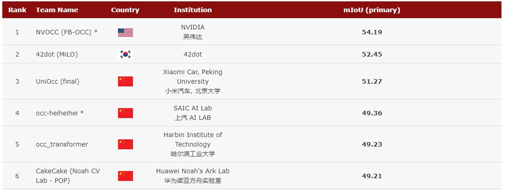
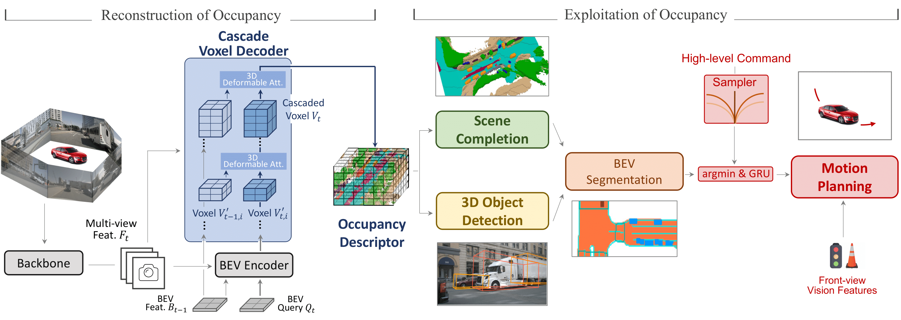
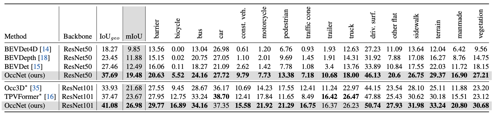

<div align="center">   

<!-- omit in toc -->
# Scene as Occupancy
</div>

We believe **Occupancy** serves as a `general` representation of the scene and could facilitate perception and planning in the full-stack of autonomous driving. 

https://github.com/OpenDriveLab/OccNet/assets/54334254/92fb43a0-0ee8-4eab-aa53-0984506f0ec3


> **Scene as Occupancy**
> - [Paper in arXiv](https://arxiv.org/abs/2306.02851) | [CVPR 2023 AD Challenge Occupancy Track](https://github.com/CVPR2023-3D-Occupancy-Prediction/CVPR2023-3D-Occupancy-Prediction)
> - Point of contact: [simachonghao@pjlab.org.cn](mailto:simachonghao@pjlab.org.cn)

<!-- omit in toc -->
## 3D Occupancy Prediction Leaderboard
We provide a full-scale [3D occupancy leaderboard](https://opendrivelab.com/AD23Challenge.html#Track3) based on the CVPR 2023 Autonomous Driving challenge. Top entries (by 06-09-2023) are provided below. Check the website out!




<!-- omit in toc -->
## Table of Contents
- [Highlights](#highlights)
- [News](#news)
- [Getting Started](#getting-started)
  - [Results and Pre-trained Models](#results-and-pre-trained-models)
- [TODO List](#todo-list)
- [License \& Citation](#license--citation)
- [Challenge](#challenge)
- [Related resources](#related-resources)

## Highlights


- :oncoming_automobile: **General Representation in Perception**: 3D Occupancy is a geometry-aware representation of the scene. Compared to the form of 3D bounding box & BEV segmentation,  3D occupancy could capture the fine-grained details of critical obstacles in the scene.
- :trophy: **Exploration in full-stack Autonomous Driving**: OccNet, as a strong descriptor of the scene, could facilitate subsequent tasks such as perception and planning, achieving results on par with LiDAR-based methods (41.08 on mIOU in 3D occupancy, 60.46 on mIOU in LiDAR segmentation, 0.703 avg.Col in motion planning).

## News
- [2023/06/06] [Paper](https://arxiv.org/abs/2306.02851) released on arxiv
- [2023/06/04] Code & model initial release `v1.0`
- [2023/06/04] 3D Occupancy and flow dataset release `v1.0`
- [2023/06/01] [CVPR AD Challenge 3D Occupancy Track](https://opendrivelab.com/AD23Challenge.html#Track3) close
- [2023/03/01] [CVPR AD Challenge 3D Occupancy Track](https://opendrivelab.com/AD23Challenge.html#Track3) launch

## Getting Started
- [Install](docs/install.md)
- [Prepare dataset](docs/prepare_dataset.md)
- [Visualization](docs/visualization.md)
- [Run the code](docs/run.md)

### Results and Pre-trained Models
We will release pre-trained weight soon.




## TODO List
- [x] 3D Occupancy and flow dataset `v1.0`
- [x] 3D Occupancy Prediction code `v1.0`
- [ ] Pre-trained Models
- [ ] Occupancy label generation code
- [ ] GT label with more voxel size
- [ ] Compatibility with other BEV encoders

## License & Citation
All assets (including figures) and code are under the [Apache 2.0 license](./LICENSE) unless specified otherwise. The data license inherits the license used in nuScenes dataset.

Please consider citing our paper if the project helps your research with the following BibTex:
```bibtex
@article{sima2023_occnet,
      title={Scene as Occupancy}, 
      author={Chonghao Sima and Wenwen Tong and Tai Wang and Li Chen and Silei Wu and Hanming Deng  and Yi Gu and Lewei Lu and Ping Luo and Dahua Lin and Hongyang Li},
      year={2023},
      eprint={2306.02851},
      archivePrefix={arXiv},
      primaryClass={cs.CV}
}
```

## Challenge
We host the first 3D occupancy prediciton challenge on CVPR 2023 End-to-end Autonomous Driving Workshop. For more information about the challenge, please refer to [here](https://github.com/CVPR2023-3D-Occupancy-Prediction/CVPR2023-3D-Occupancy-Prediction).

## Related resources
[](https://awesome.re)
- [BEVFormer](https://github.com/fundamentalvision/BEVFormer)
- [BEV Perception Survey & Recipe](https://github.com/OpenDriveLab/BEVPerception-Survey-Recipe)
